# CareerForge — AI Interview Career Support

**Project document** covering introduction, architecture diagrams, block diagrams, sequence flows, how to run on another computer, usage, and trade-offs.

---

## 1. Introduction

CareerForge is a web application that helps students prepare for company-specific technical interviews. The student signs in (email/password or Google), works through a **10-course × 10-company** catalog and a Practice / SkillBridge workspace, then takes a **four-round mock interview**. During each round the system evaluates **what** they say and **how** they present themselves:

| Signal | What it measures |
| --- | --- |
| **Answer quality** | Keyword matching and pattern matching on the typed or spoken answer |
| **Camera behavior** | Confidence, nervousness, and malpractice risk from the webcam |
| **Voice delivery** | Fluency, content accuracy, and accent/clarity (how intelligible the speech is to ASR) |
| **Skill / chance** | Technical, communication, and problem-solving scores, plus an estimated chance of advancing this screen |

The goal is structured practice: company-specific rounds, adaptive difficulty across four rounds, camera and voice signals, and a results pack (readiness, chance %, weak areas) after submit. Rubric chips are **not** shown live in the answer box.

### 1.1 Problem

Students often know the syllabus but freeze in interviews. Typical prep apps score only written answers, or only length. They miss:

- whether the answer actually contains the expected concepts
- whether the candidate looks away, leaves the frame, or appears with another person
- whether spoken answers are fluent, on-topic, and clear enough to be understood
- how a role’s hiring signals change across a course track

### 1.2 Objectives

1. Guide the student from login → dashboard → practice or course/company → four-round mock → result.
2. Score answers with **keywords** (concepts) and **patterns** (definition, comparison, example).
3. Analyze the webcam for confidence, nervousness, and integrity flags.
4. Score voice answers for **fluency**, **accuracy**, and **accent/clarity** (ASR intelligibility, not a linguistic accent classifier).
5. Keep the ML stack in a separate Python service so models can be retrained without rewriting the UI.
6. Persist accounts and sessions in MySQL when reachable, otherwise JSON files under `backend/data/`.

---

## 2. System architecture

CareerForge is a **three-process** system. The browser never talks to MySQL, JSON account files, or `.pkl` / ONNX models directly.

### 2.1 Architecture diagram

High-level deployment: one student browser, two local HTTP services, optional Google Identity, and a persistence layer that prefers MySQL and falls back to JSON files.

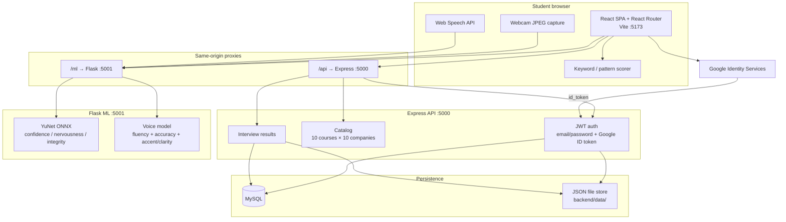

```text
                         STUDENT BROWSER (React + Vite :5173)
  +------------------+  +------------------+  +------------------+
  | Pages / Router   |  | Keyword matcher  |  | Camera + Mic     |
  | login, practice, |  | evaluateAnswer.js|  | JPEG + transcript|
  | mock, SkillBridge|  |                  |  |                  |
  +--------+---------+  +------------------+  +--------+---------+
           |  /api/*                                   |  /ml/*
           v                                           v
  +----------------------------+            +----------------------------+
  | Express API :5000          |            | Flask ML :5001             |
  | JWT, Google token verify   |            | POST /analyze-emotion      |
  | Catalog 10 courses x 10    |            | POST /analyze-voice        |
  | Save interview sessions    |            | YuNet + voice regressor    |
  +-------------+--------------+            +----------------------------+
                |
        +-------+--------+
        |                |
        v                v
  +-----------+   +------------------+
  | MySQL     |   | JSON file store  |
  | if up     |   | if MySQL times out|
  +-----------+   +------------------+
```

**Figure 1.** System architecture — client, API, ML, and storage.

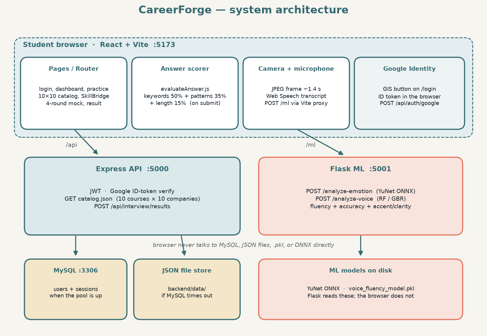

### 2.2 Block diagram (product modules)

This block diagram is the product, not the processes. Left = prepare. Centre = mock interview. Right = explain and persist.

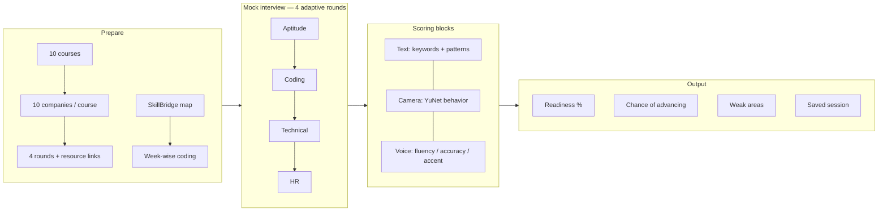

```text
+------------------+     +---------------------------+     +--------------------+
| PREPARE          |     | MOCK (4 adaptive rounds)  |     | OUTPUT             |
|                  |     |                           |     |                    |
| 10 courses       |     | 1 Aptitude                |     | Company readiness  |
| 10 companies     |---->| 2 Coding                  |---->| Chance of advancing|
| Round resources  |     | 3 Technical               |     | Weak areas         |
| SkillBridge map  |     | 4 HR                      |     | Saved to account   |
| Week-wise coding |     |                           |     |                    |
+------------------+     +-------------+-------------+     +--------------------+
                                       |
                         +-------------+-------------+
                         | SCORING BLOCKS            |
                         | Text | Camera | Voice     |
                         +---------------------------+
```

**Figure 2.** Product block diagram.

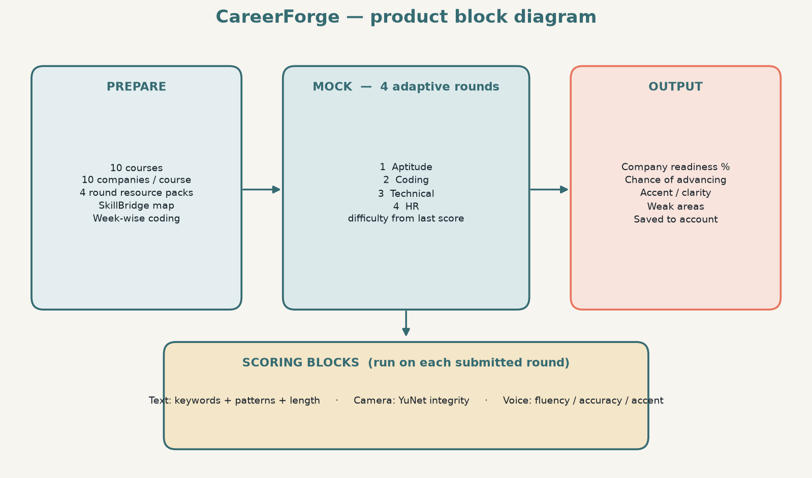

### 2.3 Interview scoring block diagram

Each submitted round runs three independent blocks. Results are combined only after submit (the live answer box does not show the rubric).

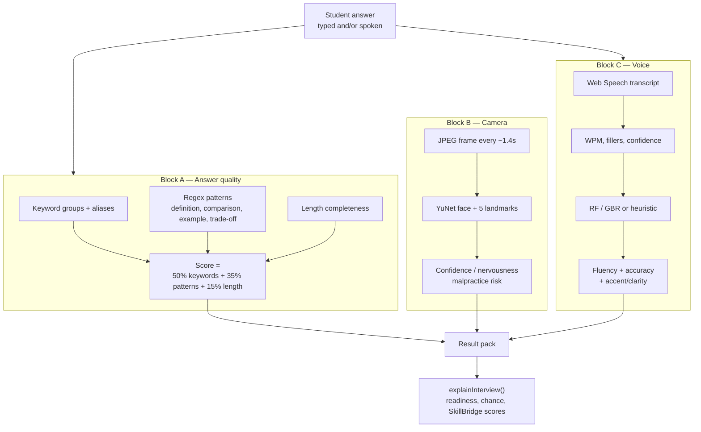

**Figure 3.** Scoring block diagram.

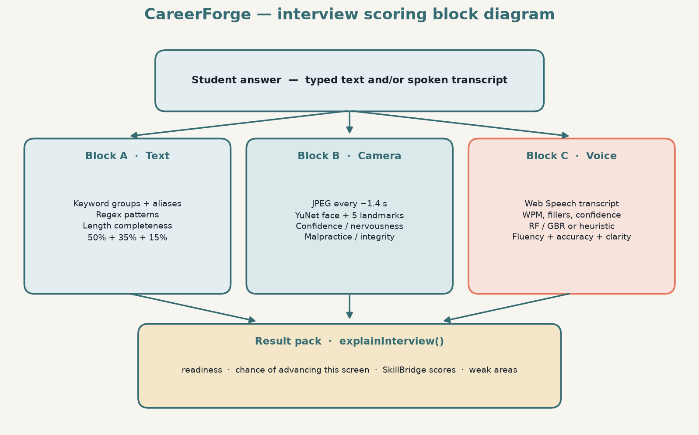

### 2.4 Components

| Layer | Port | Role |
| --- | --- | --- |
| **React frontend** | 5173 | Login (email or Google), dashboard, practice, 10×10 catalog, preparation, 4-round mock, result, SkillBridge |
| **Express backend** | 5000 | Auth (JWT), Google token verify, catalog, saved interviews; proxies `/ml` in production builds |
| **MySQL** | 3306 | Users and interview sessions when reachable |
| **JSON file store** | — | Fallback when MySQL times out (`backend/data/`) |
| **Flask ML service** | 5001 | Emotion / integrity, voice fluency, accuracy, accent/clarity |

Vite (and Express after `npm run build`) proxy `/api` and `/ml`, so the browser uses one origin.

### 2.5 Frontend page flow

Routing is **React Router** in `src/App.jsx`.

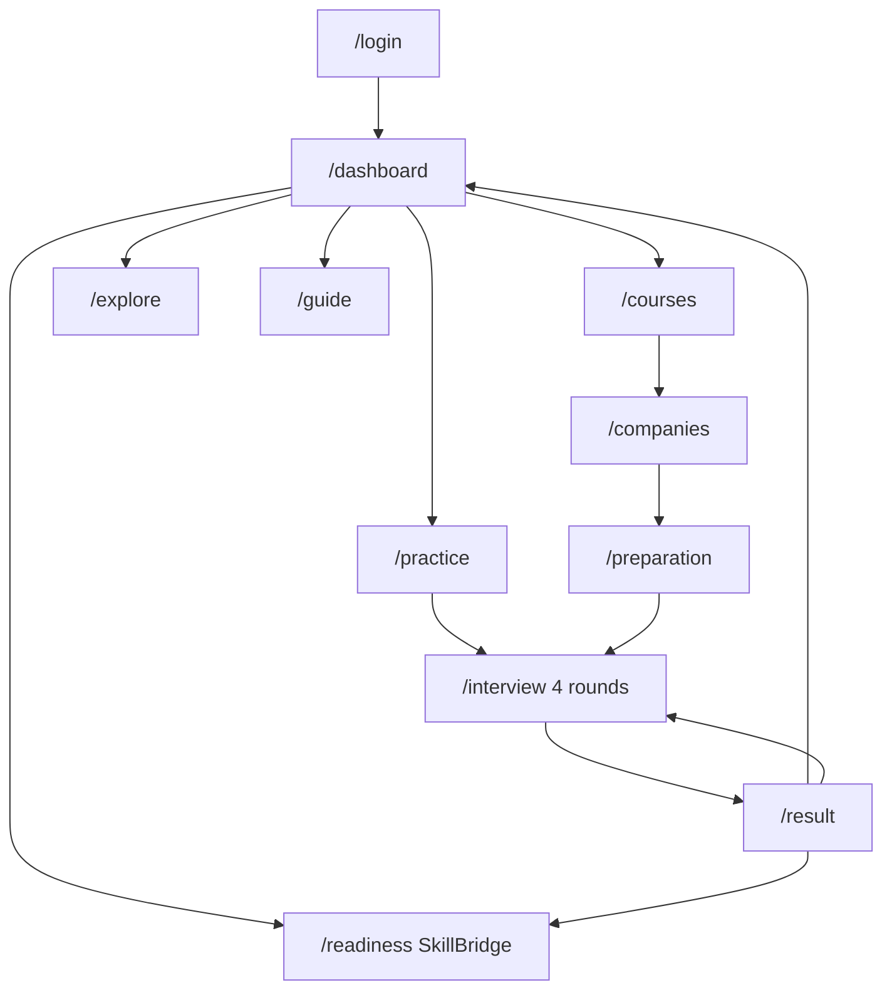

---

### 2.6 ML modules

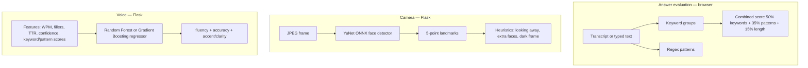

**Skill model** (`train_model.py`): `RandomForestClassifier` on `technical_score`, `communication_score`, `problem_solving` → `skill_level` (Strong / Average / Weak).

**Voice model** (`train_voice_model.py`): generates labeled feature rows, trains **Random Forest** and **Gradient Boosting** (`MultiOutputRegressor`), and saves the better average R² model as `voice_fluency_model.pkl`. If the pickle is missing, `/analyze-voice` falls back to a heuristic scorer.

**Camera model**: OpenCV **YuNet** (`models/face_detection_yunet_2023mar.onnx`). Landmarks drive looking-away, looking-down, smile proxy, and fidgeting. Face count and brightness drive malpractice flags.

---

## 3. Sequence diagrams

### 3.1 End-to-end student journey

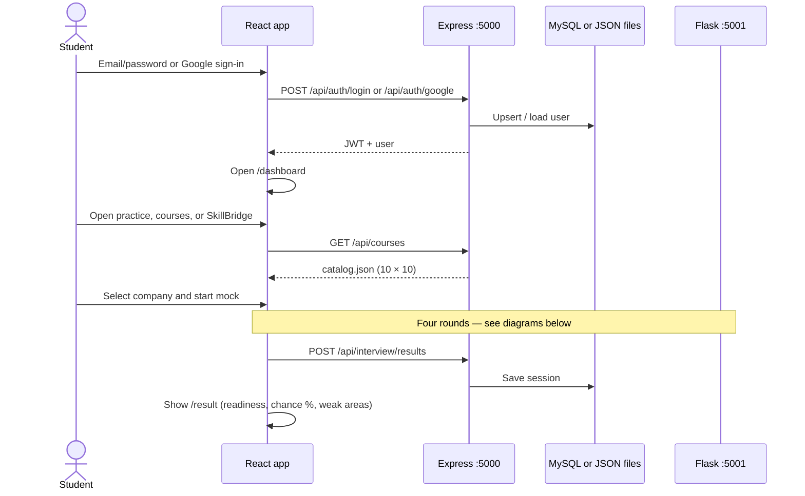

The course list is served from `src/data/catalog.json`, not from a MySQL catalog table.

### 3.2 Mock interview — answer scoring (keywords and patterns)

```mermaid
sequenceDiagram
  actor Student
  participant Box as Answer textarea
  participant Eval as evaluateAnswer.js
  participant UI as MockInterview

  Student->>Box: Type or dictate answer
  Student->>UI: Submit answer
  UI->>Eval: text + current question spec
  Eval->>Eval: Match keyword aliases
  Eval->>Eval: Test regex patterns
  Eval-->>UI: keyword %, pattern %, length, combined score
  UI->>UI: Store round; set next-round difficulty from last score
  UI->>UI: Next of 4 rounds or finish
```

Keyword groups allow aliases (for example **mutable** also matches “can be changed”). Patterns check structure: definition phrasing, comparison words, examples, prevention methods. Difficulty of the **next** round is foundation / applied / corporate from the last score — not a live Easy → Medium → Hard unlock while typing.

### 3.3 Camera emotion and integrity

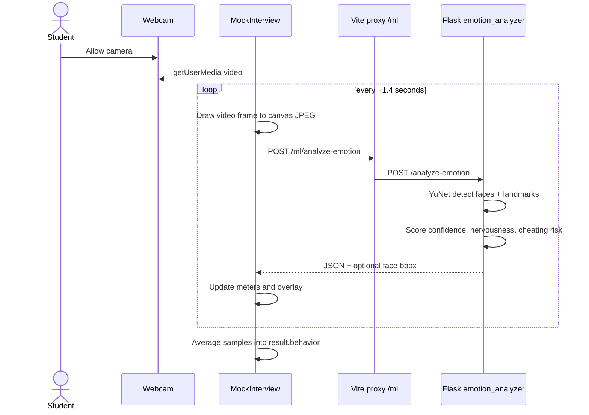

Integrity examples:

- **Clear** — one frontal face, looking at the camera
- **Warning** — looking away, fidgeting, moderate risk
- **Flagged** — no face, covered camera, or multiple people

### 3.4 Voice fluency and accuracy

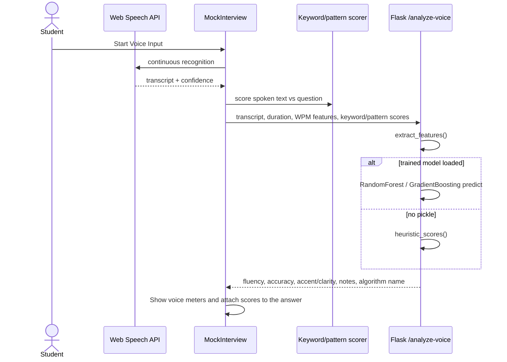

**Fluency** is driven by words per minute, filler ratio, unique-word ratio, repetition, pauses, and recognition confidence.

**Accuracy** is driven by keyword coverage, pattern coverage, and speech-recognition confidence (how clearly the words were heard).

**Accent/clarity** is an intelligibility estimate from the transcript and recognition confidence. It is **not** a linguistic accent identifier (for example it does not label “Indian English” vs “US English”).

### 3.5 Persist interview session

After the four rounds (or End interview), the result page posts a session. Express writes MySQL when the pool is up; otherwise it writes `backend/data/sessions.json`.

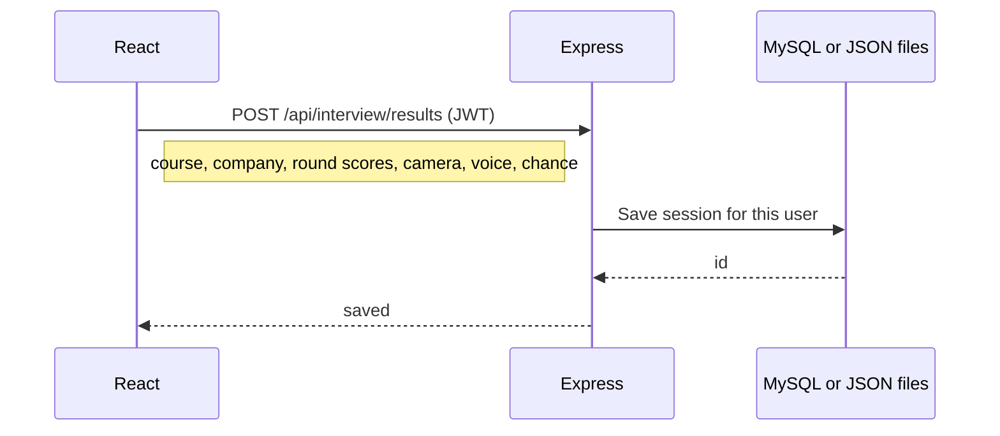

---

## 4. Usage — run on another computer

Share the **project folder** (USB, zip, or git clone). The other PC must install Node.js and Python, then run the commands below. **Three terminals stay open** while the app is used.

MySQL is **optional**. If MySQL is missing, login and saved interviews still work using `backend/data/*.json`. Google Sign-In is **optional**.

### 4.1 Software to install first (once per computer)

1. **Node.js LTS** (20 or 22) from https://nodejs.org — this also installs `npm`. Restart the terminal after install.
2. **Python 3.10+** from https://www.python.org/downloads/ — on Windows tick **Add python.exe to PATH**.
3. **Google Chrome** or **Microsoft Edge** (needed for Voice Input).
4. Optional: **MySQL Server** if you want a real database instead of JSON files.

Check that the tools work:

```powershell
node -v
npm -v
py -3 --version
```

On macOS / Linux use `python3 --version` instead of `py -3 --version`. If `node` or `py` is not found, close the terminal and open a new one, or reinstall with PATH enabled.

### 4.2 What to copy (and what to leave out)

**Copy the whole `ai_careerforge` folder**, including `src/`, `backend/` (except secrets), `ml_service/`, and `ml_service/models/face_detection_yunet_2023mar.onnx`.

**Do not copy** these (the new PC recreates them):

| Leave out | Why |
| --- | --- |
| `node_modules/` and `backend/node_modules/` | Too large; run `npm install` instead |
| `backend/.env` | Contains passwords; create a new file from `.env.example` |
| `backend/data/` | Local user accounts on *your* machine |
| `dist/` | Production build output |
| `__pycache__/` | Python cache |

If you use git, those paths are already gitignored.

### 4.3 Windows — all commands (PowerShell)

Open **PowerShell**. Replace the first `cd` with the real folder path on that PC.

**A. Install libraries (once)**

```powershell
cd "C:\Users\YOUR_NAME\Desktop\ai_careerforge"

node -v
npm -v
py -3 --version

npm install

cd backend
npm install
Copy-Item .env.example .env
cd ..

cd ml_service
py -3 -m pip install --upgrade pip
py -3 -m pip install -r requirements.txt
py -3 train_model.py
py -3 train_voice_model.py
cd ..
```

Edit `backend\.env` in Notepad if MySQL is installed (set `DB_PASSWORD` to that PC’s MySQL root password). If MySQL is **not** installed, leave `.env` as copied — the API will print `Accounts: file store` and still work.

**B. Start the app (every time) — three windows**

Keep all three running. Do not close them.

Terminal 1 — Flask ML (`http://127.0.0.1:5001`):

```powershell
cd "C:\Users\YOUR_NAME\Desktop\ai_careerforge\ml_service"
py -3 app.py
```

Terminal 2 — Express API (`http://127.0.0.1:5000`):

```powershell
cd "C:\Users\YOUR_NAME\Desktop\ai_careerforge\backend"
node server.js
```

Terminal 3 — React UI (`http://127.0.0.1:5173`):

```powershell
cd "C:\Users\YOUR_NAME\Desktop\ai_careerforge"
npm run dev
```

**C. Open the app**

In Chrome, go to:

```text
http://127.0.0.1:5173
```

Use **127.0.0.1**, not `localhost`, if you later add Google Sign-In (Google treats them as different sites).

### 4.4 macOS / Linux — all commands

**A. Install libraries (once)**

```bash
cd ~/Desktop/ai_careerforge

node -v
npm -v
python3 --version

npm install

cd backend
npm install
cp .env.example .env
cd ..

cd ml_service
python3 -m pip install --upgrade pip
python3 -m pip install -r requirements.txt
python3 train_model.py
python3 train_voice_model.py
cd ..
```

**B. Start the app (every time) — three terminals**

Terminal 1:

```bash
cd ~/Desktop/ai_careerforge/ml_service
python3 app.py
```

Terminal 2:

```bash
cd ~/Desktop/ai_careerforge/backend
node server.js
```

Terminal 3:

```bash
cd ~/Desktop/ai_careerforge
npm run dev
```

Open http://127.0.0.1:5173

### 4.5 Optional MySQL

Only if you want accounts in MySQL instead of JSON files.

```sql
CREATE DATABASE ai_interview_career_support_db;
```

Then set these in `backend/.env` (never share this file):

```text
DB_HOST=localhost
DB_USER=root
DB_PASSWORD=YOUR_MYSQL_PASSWORD
DB_NAME=ai_interview_career_support_db
JWT_SECRET=any-long-random-string
PORT=5000
ML_ORIGIN=http://127.0.0.1:5001
GOOGLE_CLIENT_ID=
```

Tables are created automatically on API start (`ensureSchema`). Restart `node server.js` after editing `.env`.

### 4.6 Optional Google Sign-In

1. Google Cloud Console → APIs & Services → Credentials → Create OAuth client ID → **Web application**.
2. Authorized JavaScript origins: `http://127.0.0.1:5173` and `http://localhost:5173` and `http://127.0.0.1:5000`.
3. Paste the client ID into `GOOGLE_CLIENT_ID=` in `backend/.env`.
4. Restart `node server.js`.

Leave `GOOGLE_CLIENT_ID` empty to use email/password only.

### 4.7 Check it is running

With the three terminals open, run in a **fourth** window:

```powershell
curl http://127.0.0.1:5001/health
curl http://127.0.0.1:5000/api/health
```

You should see JSON with `"ok": true`. Then open http://127.0.0.1:5173 and register a new account.

| Problem | Fix |
| --- | --- |
| `node` is not recognized | Reinstall Node.js LTS; close and reopen the terminal |
| `py` / `python` is not recognized | Reinstall Python with **Add to PATH**; use `py -3` on Windows |
| Port 5173 / 5000 / 5001 already in use | Close the old CareerForge windows and start again |
| Camera or voice offline | Terminal 1 (`py -3 app.py`) must be running; allow camera/mic in Chrome |
| `Accounts: file store` in the API window | Normal when MySQL is off — login still works |
| Page loads but login fails | Confirm Terminal 2 is running and the browser uses `http://127.0.0.1:5173` |

### 4.8 How to use the product

1. Register or sign in with email/password, or Google if `GOOGLE_CLIENT_ID` is set.
2. Dashboard: Practice, course path, Explore, Guide, or SkillBridge (`/readiness`).
3. Practice: pick course → company → open round resources (real URLs) → start mock; or Courses → company → preparation → mock.
4. Complete **four adaptive rounds** (aptitude, coding, technical, HR — names follow the course track).
5. **Answer box:** type a full answer. Scoring runs **on submit** (keywords 50% + patterns 35% + length 15%).
6. **Camera:** allow access. Watch confidence, nervousness, and malpractice risk. Sit in a bright room, one person in frame, facing the camera.
7. **Voice:** use Voice Input in Chrome. The transcript fills the box; Flask scores fluency, accuracy, and accent/clarity when the ML service is up (browser fallback if Flask is down).
8. Next-round difficulty follows the last round’s score (foundation / applied / corporate).
9. Result page: company readiness, chance of advancing this screen, accent/clarity, weak areas, SkillBridge-style skill scores. Session is saved to the signed-in account.

### 4.9 Main API map

| Method | Path | Purpose |
| --- | --- | --- |
| GET | `/api/health` | API health |
| GET | `/api/auth/config` | Public Google client id (may be empty) |
| POST | `/api/auth/register` | Email/password register |
| POST | `/api/auth/login` | Email/password login |
| POST | `/api/auth/google` | Google ID-token login |
| GET | `/api/auth/me` | Current user (JWT) |
| GET | `/api/courses` | 10 courses from `catalog.json` |
| GET | `/api/courses/:id/companies` | 10 companies for a course |
| GET | `/api/companies/:id/requirements` | Company requirements |
| GET | `/api/requirements/detect` | Hiring-cycle detector (static snapshots, not live scraping) |
| POST | `/api/interview/results` | Save interview session (JWT) |
| GET | `/api/me/results` | Saved sessions for the signed-in user |
| GET | `http://127.0.0.1:5001/` | ML health |
| POST | `http://127.0.0.1:5001/predict` | Skill level from three scores |
| POST | `http://127.0.0.1:5001/analyze-emotion` | Camera frame |
| POST | `http://127.0.0.1:5001/analyze-voice` | Fluency, accuracy, accent/clarity |

---

## 5. Pros and cons

### 5.1 Pros

- **End-to-end loop** from Practice / SkillBridge to a four-round scored result, not a single quiz page.
- **Explainable answer scoring** — keyword and pattern rules are documented; scores appear after submit.
- **Adaptive rounds** — next-round difficulty follows the last score (foundation / applied / corporate).
- **Separate ML service** — OpenCV and sklearn stay in Python; the UI stays in React.
- **Integrity signals** that matter in remote interviews: extra faces, empty frame, covered camera, looking down.
- **Voice model is trainable** — Random Forest vs Gradient Boosting, heuristic fallback if the pickle is absent.
- **Auth with fallback storage** — JWT, optional Google Sign-In, MySQL or JSON files.
- **Dev-friendly proxy** — one origin for the browser via Vite `/api` and `/ml`.

### 5.2 Cons

- **Not a substitute for a human interviewer.** Keyword lists can miss a valid unusual answer; camera heuristics can flag looking at notes when the student is only thinking.
- **YuNet cues are not clinical emotion recognition.** Confidence and nervousness are behavioral estimates.
- **Voice depends on the browser transcript.** Noise, Chrome-only Speech API, and ASR errors limit quality.
- **Accent/clarity is intelligibility, not a linguistic accent model.**
- **Voice training data is synthetic** (generated feature rows), so the regressor learns a designed policy, not a large corpus of real interviews.
- **Hiring-cycle detector** diffs static snapshots (`companySignals.js`); it does not scrape live job boards.
- **Three processes** must run together; if Flask is down, camera/voice show offline errors while typed scoring still works.
- **Google Sign-In** needs a real OAuth client ID in `.env`; empty id hides the Google button.

---

## 6. Project structure

```text
ai_careerforge/
  src/
    App.jsx                 # React Router
    data/
      catalog.json          # 10 courses × 10 companies
      interviewBank.js      # mock questions
      practiceResources.js  # round resource URLs
      skillMaps.js          # SkillBridge chains
      companySignals.js     # hiring-cycle snapshots
    pages/                  # Login, Dashboard, Practice, interview, Result, ReadinessHub, ...
    utils/
      evaluateAnswer.js     # keywords + regex patterns
      adaptiveInterview.js  # 4 rounds, difficulty, conversionChance
      explainSkills.js      # result pack
      accentScore.js        # client fallback if Flask is down
  backend/
    server.js               # Express REST + /ml proxy in production
    auth.js / accounts.js   # JWT, Google upsert
    db.js                   # MySQL pool from .env
    data/                   # JSON fallback (gitignored)
  ml_service/
    app.py                  # Flask: predict, analyze-emotion, analyze-voice
    emotion_analyzer.py     # YuNet + integrity heuristics
    voice_features.py       # fluency / accuracy / accent features
    train_model.py          # skill Random Forest
    train_voice_model.py    # voice Random Forest / GBR
    models/                 # YuNet ONNX
  DOCUMENTATION.md
  CareerForge_Documentation.docx
```

---

## 7. Limitations and future work

- Replace synthetic voice labels with recorded mock interviews and human fluency/accuracy ratings.
- Use a dedicated speech model (Whisper / wav2vec) instead of browser transcription.
- Train a real accent classifier only with labeled speech; do not treat the current score as ethnicity or region detection.
- Prefer MySQL in production and keep JSON only as a local fallback.
- Expand live job-board ingestion if the requirement detector should reflect the market, not snapshots.
- Put a reverse proxy (nginx) in front of the built SPA, Express, and Flask for a single production origin.

---

## 8. Summary

CareerForge is a three-process mock-interview system: a React SPA (Vite :5173), an Express API (:5000) with JWT/Google auth and a 10×10 catalog, and a Flask ML service (:5001) for camera and voice. Product blocks are **prepare** (practice, SkillBridge, resources), **mock** (four adaptive rounds), **scoring** (text, camera, voice), and **output** (readiness, chance of advancing, weak areas). The models are practice tools, not production proctoring or medical diagnostics.
